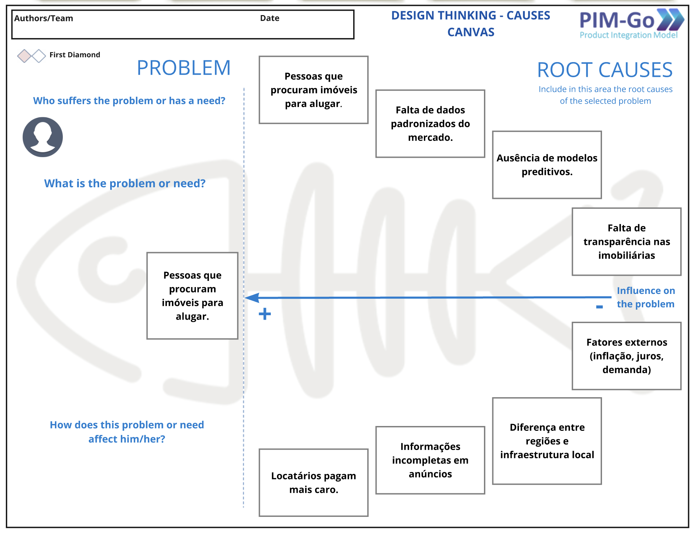
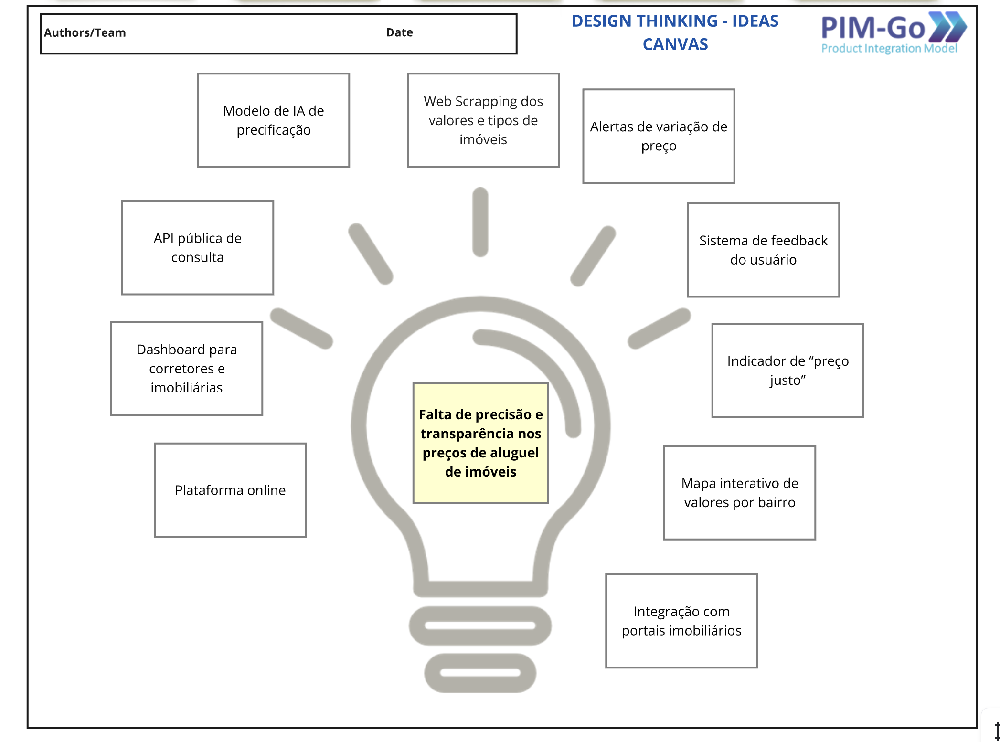
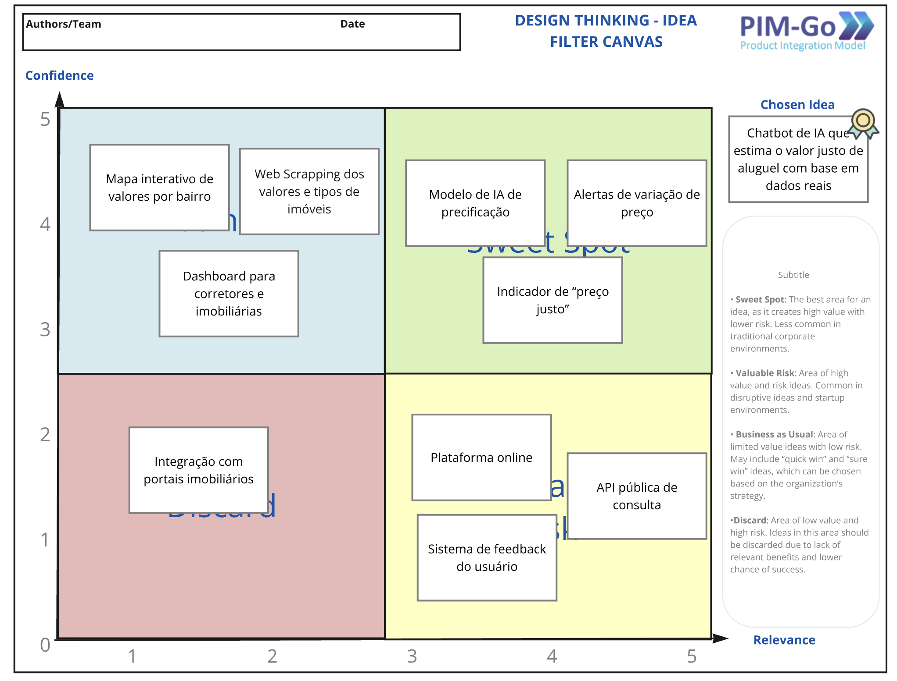
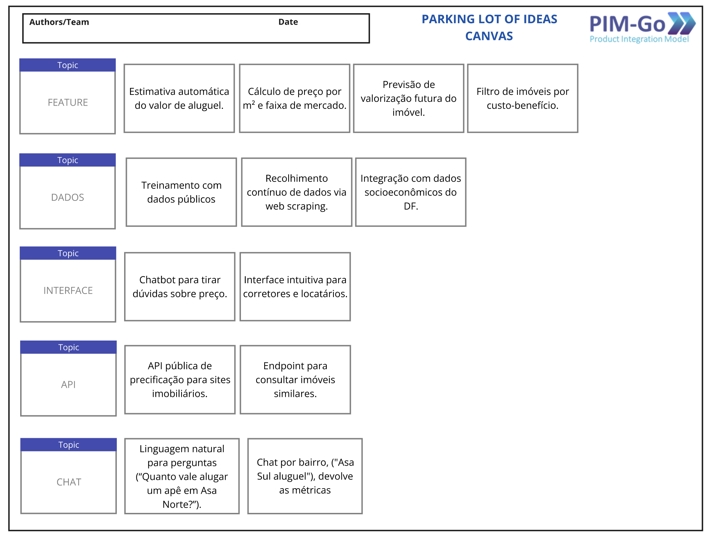
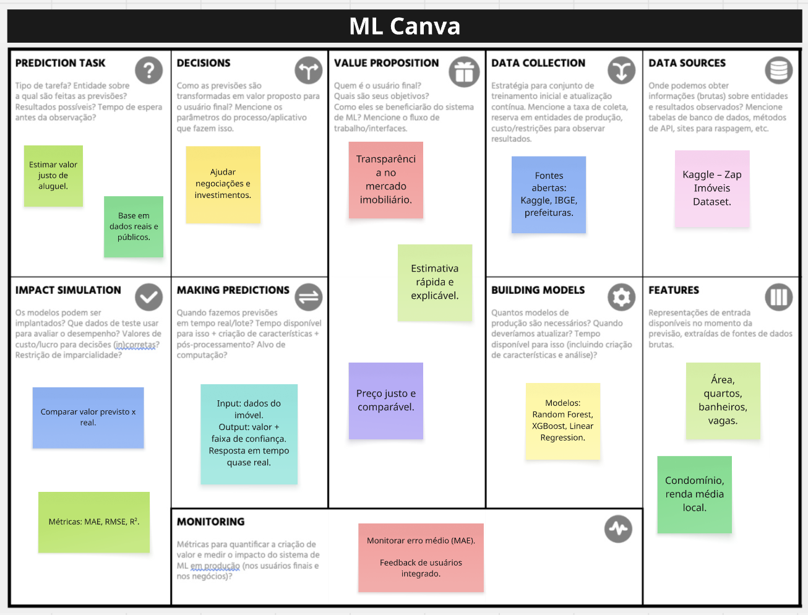

# Artefatos

## 1. Introdução

Este documento tem como objetivo apresentar e detalhar os artefatos criados durante a fase inicial de concepção do projeto **Predição de Valor de Aluguel de Imóveis com IA**.

O propósito do projeto é desenvolver uma solução inteligente capaz de **estimar o valor justo de aluguel de imóveis** com base em dados públicos e reais do mercado, promovendo **transparência, acessibilidade e eficiência** no setor imobiliário.

A fase de concepção foi fundamental para transformar uma necessidade do mercado em um **plano de projeto estruturado**, com escopo, funcionalidades e tecnologias bem definidas.

---

## 2. Framework e Ferramentas Utilizadas

A metodologia de concepção foi apoiada pelo framework **PIM-Go (Product Integration Model)**, que fornece modelos e templates para guiar o processo de design de produto de forma sistemática.  
Adicionalmente, foram utilizadas ferramentas de apoio à modelagem de **Machine Learning**, para estruturar o núcleo de IA responsável pela predição dos valores.

**Ferramentas utilizadas:**

- **Framework PIM-Go:**
  - Design Thinking – Causas  
  - Design Thinking – Ideias  
  - Filtro de Ideias  
  - Parking Lot de Ideias  

- **Ferramenta técnica:**
  - **Machine Learning Canvas** – para definição do fluxo e arquitetura do modelo preditivo.

---

## 3. Detalhamento dos Artefatos

### 3.1. Artefato 1 – Design Thinking: Causes Canvas

**Descrição da Ferramenta:**  
Modelo visual baseado no Diagrama de Ishikawa (Espinha de Peixe), utilizado para identificar **as causas-raiz** de um problema central.  

**Aplicação no Projeto:**  
Foi utilizado para decompor o problema principal de **falta de transparência e precisão nos valores de aluguel de imóveis**, permitindo compreender os fatores que influenciam a precificação desigual.  

**Principais Insights:**
- **Problema central:** Dificuldade de estimar o valor justo de aluguel.  
- **Causas-raiz identificadas:**
  - Falta de dados padronizados e atualizados do mercado.  
  - Ausência de modelos preditivos inteligentes.  
  - Informações incompletas nos anúncios.  
  - Diferenças regionais e infraestrutura local.  
  - Subjetividade na avaliação dos corretores.  
  - Fatores econômicos externos (inflação, juros, demanda).  

<b>Figura 1</b> – Causes Canvas – Predição de Aluguel

<b>Fonte:  <a href="https://github.com/EliasOliver21">Elias Oliveira</a> e <a href="https://github.com/gabriel-lima258">Gabriel Lima</a></b>

---

### 3.2. Artefato 2 – Design Thinking: Ideas Canvas

**Descrição da Ferramenta:**  
Canvas voltado para a **ideação da solução**, estruturando conceitos e funcionalidades do produto.  

**Aplicação no Projeto:**  
A ferramenta foi usada para converter o problema de precificação desigual em uma **solução inovadora baseada em IA**, capaz de aprender padrões reais do mercado imobiliário.  

**Principais Insights:**
- **Ideia central:** Plataforma de IA para estimar o valor justo de aluguel.  
- **Principais funcionalidades:**
  - Estimativa automática do valor de aluguel.  
  - Mapa interativo com preços médios por bairro.  
  - Dashboard para corretores.  
  - API pública de consulta.  
  - Chatbot para tirar dúvidas sobre preços. 

<b>Figura 2</b> – Ideas Canvas – Predição de Aluguel

 

<b>Fonte:  <a href="https://github.com/EliasOliver21">Elias Oliveira</a> e <a href="https://github.com/gabriel-lima258">Gabriel Lima</a></b>

---

### 3.3. Artefato 3 – Idea Filter Canvas

**Descrição da Ferramenta:**  
Matriz de priorização que avalia as ideias geradas com base em **Relevância** e **Confiança**, para definir o foco do desenvolvimento.  

**Aplicação no Projeto:**  
O filtro foi usado para avaliar as ideias levantadas no *Ideas Canvas* e determinar o escopo do MVP.  

**Principais Insights:**
- **Sweet Spot (Alta relevância, Alta confiança):**
  - Modelo de IA de precificação.  
  - Indicador “Preço Justo”.  
  - Alertas automáticos de variação de valor.  
- **Valuable Risk:**  
  - API pública de integração com portais.  
  - Aplicativo mobile.  
- **Business as Usual:**  
  - Dashboard de corretores e mapa interativo.  

<b>Figura 3</b> – Idea Filter Canvas – Predição de Aluguel

  

<b>Fonte:  <a href="https://github.com/EliasOliver21">Elias Oliveira</a> e <a href="https://github.com/gabriel-lima258">Gabriel Lima</a></b>

---

### 3.4. Artefato 4 – Parking Lot of Ideas

**Descrição da Ferramenta:**  
Técnica usada para **registrar todas as ideias geradas**, sem ainda aplicar filtros ou priorização.  

**Aplicação no Projeto:**  
O *Parking Lot* serviu como repositório de todas as funcionalidades e componentes do sistema, formando uma visão completa da solução.  

**Principais Insights:**
- **Feature:** Estimativa automática, cálculo de preço por m², histórico de valores.  
- **Dados:** Treinamento com dados públicos (Zap, IBGE, IPTU) e atualização contínua.  
- **Interface:** Chatbot, mapa interativo, e dashboard simples.  
- **API:** Integração com sites imobiliários e retorno em JSON.  
- **Chat:** Linguagem natural e interação via Telegram/Web.  
  

<b>Figura 4</b> – Parking Lot of Ideas Canvas – Predição de Aluguel

<b>Fonte:  <a href="https://github.com/EliasOliver21">Elias Oliveira</a> e <a href="https://github.com/gabriel-lima258">Gabriel Lima</a></b>

---

### 3.5. Artefato 5 – Machine Learning Canvas

**Descrição da Ferramenta:**  
Canvas estratégico para planejar sistemas baseados em IA, destacando proposta de valor, dados, features e métricas.  

**Aplicação no Projeto:**  
Foi usado para estruturar o modelo preditivo de preços de aluguel, conectando os aspectos técnicos e de negócio.  

**Principais Insights:**
- **Proposta de valor:** Estimar o preço justo e reduzir distorções no mercado de aluguel.  
- **Dados:** Base de imóveis (Kaggle, IBGE, portais públicos).  
- **Features:** Área, número de quartos, banheiros, localização, taxa de condomínio.  
- **Modelo:** Regressão (RandomForest, XGBoost).  
- **Avaliação:** MAE, RMSE e comparação com valor de mercado real.  
- **Risco crítico:** Dados desatualizados e ruído em anúncios.  
- **Métrica de sucesso:** Precisão das previsões e satisfação dos usuários.  

<b>Figura 5</b> – ML Canvas – Predição de Aluguel

 

<b>Fonte:  <a href="https://github.com/EliasOliver21">Elias Oliveira</a> e <a href="https://github.com/gabriel-lima258">Gabriel Lima</a></b>

---

## 4. Conclusão

A aplicação sistemática do framework **PIM-Go** e dos canvas de concepção permitiu transformar uma necessidade do mercado imobiliário em um projeto de IA estruturado e validado.  

O processo resultou em:
- Um entendimento claro das dores dos usuários (locatários e corretores).  
- Um escopo técnico e funcional sólido.  
- A definição de um **MVP** viável, com foco em **estimativa de valor justo e acessibilidade digital**.  

Essa base fornece segurança para avançar para as próximas etapas de **prototipagem, modelagem e integração dos componentes de IA**.

---

## Histórico de versões
| Versão | Data | Descrição | Autor | Revisor
| :-: | :-: | :-: | :-: | :-:|
|`1.0`| 23/09/2025 | Criação do documento | [Elias Oliveira](https://github.com/EliasOliver21), [Mateus]() e [Gabriel]() | |
|`2.0`| 07/10/2025 | Reformulação dos artefatos | [Gabriel Lima](https://github.com/gabriel-lima258), [Mateus]() e [Gabriel]() | |